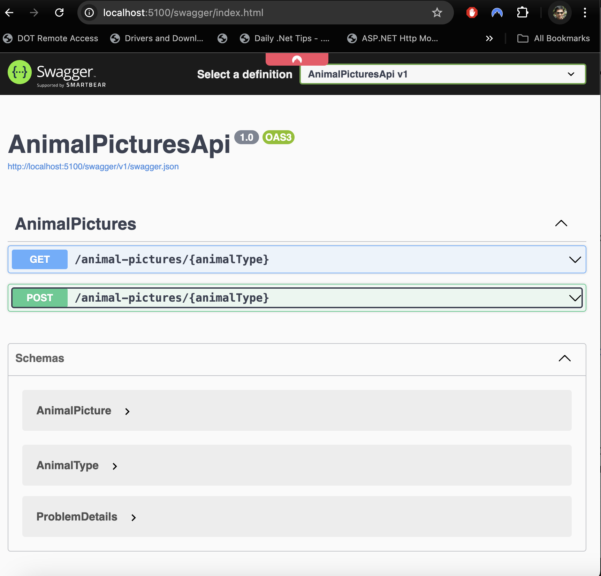
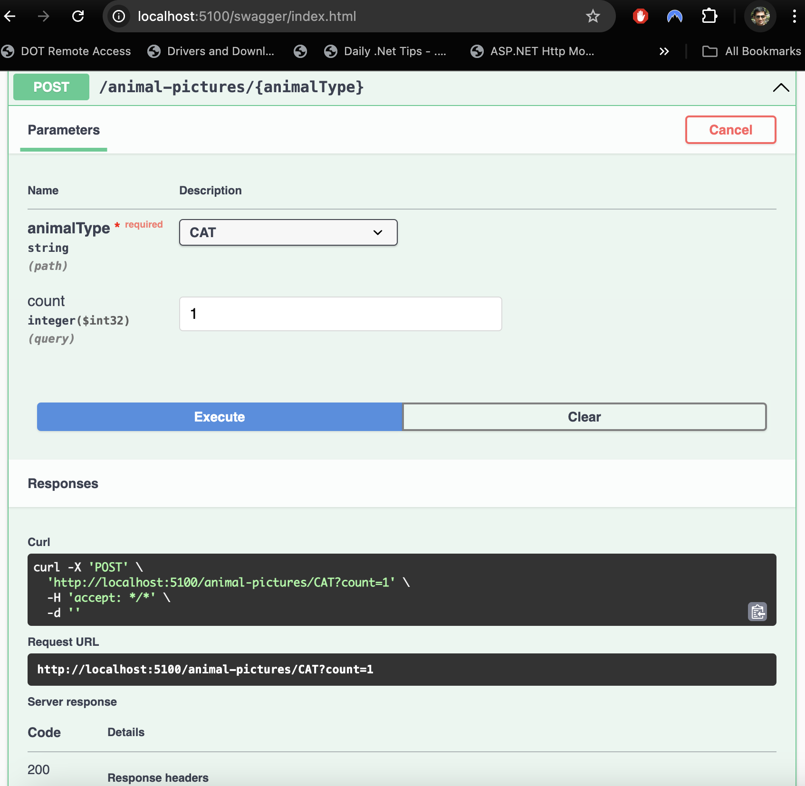
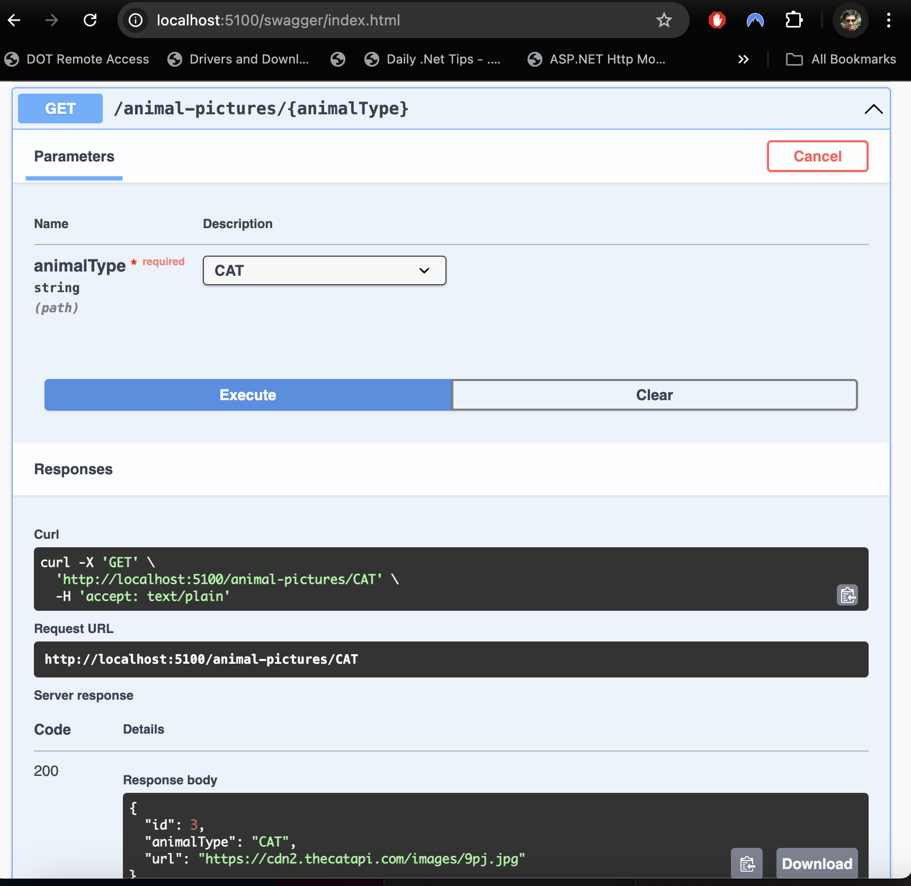

(cat-api)[https://placebear.com/]

# Animal Pictures API  

This is a sample microservice based on ASP.NET Core 8.0 that fetches a random picture of a cat, a dog, or a bear.

This microservice exposes:  

1. a REST API to pull pictures based on an animal type provided and a
number of pictures to fetch. Those pictures will be stored in `MySql` database.
1. a REST API that fetches the last picture stored of an animal.  

External APIs to fetch animal images.  

**CAT**
https://api.thecatapi.com/v1/images/search 
https://api.thecatapi.com/v1/images/search?limit=10  

**DOG**  
https://dog.ceo/api/breeds/image/random  

**BEAR**  
https://placebear.com/  

## Prerequisites  

1. DotNET Core 8.0 SDK
1. Docker  
1. IDE of your choise (JetBrains Rider, Visual Studio Code etc)  

## Running the App  

Spin up the MySql instance 

```bash
docker-compose up -d mysql
```

Run the app
```bash
cd AnimalPicturesApi
dotnet run
```

> You can run the app from IDE as well.

## Testing API Endpoints  

Browse http://localhost:5100/swagger/  

You should see    

Fetch some *CAT* images using API endpoint   

Get last saved image using API endpoint    

**Remove MySQL container**  
```bash
cd ..
docker compose down
```  

## Containerize and Run the App  

To build and run AnimalPicturesApi in container along with MySql instance  
```bash
docker compose up -d
```  

To test endpoints, browse http://localhost:7258/swagger/  

Clean up container after testing  
```bash
docker compose down
```

## Things to Implement  

1. Restructure database tables to support `Bear` images  
1. Add more unit and integration tests
1. Use [WireMock.Net](https://github.com/WireMock-Net/WireMock.Net) to mock the external APIs
1. Implement circuit breaker pattern for all external API calls and database calls to handle transient errors. See [Polly](https://github.com/App-vNext/Polly) library. 
1. Use database migration tools like [FlyWay](https://www.red-gate.com/products/flyway/community/) or [EF Core Migrations](https://learn.microsoft.com/en-us/ef/core/managing-schemas/migrations/?tabs=dotnet-core-cli) to manage datbase chnages.
1. Create `bash` and/or `powershell` scripts to build, test, publish and run the application.